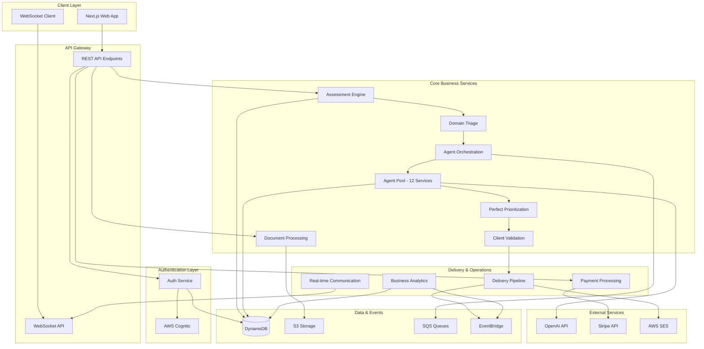

# Components

Based on the API specification and AWS Lambda architecture, ScaleMap is organized into **logical service components** that can scale independently. Each component has clear responsibilities and well-defined interfaces.

## Authentication & Authorization Service

**Responsibility:** User authentication, company profile management, and access control

**Key Interfaces:**
- `POST /auth/login` - Cognito authentication
- `POST /auth/refresh` - JWT token refresh
- `GET /companies/{id}` - Company profile access
- `PUT /companies/{id}` - Company profile updates

**Dependencies:** AWS Cognito, DynamoDB Companies table

**Technology Stack:** 
- **Lambda Functions:** `auth-handler`, `company-profile-handler`
- **Storage:** Cognito User Pools, DynamoDB
- **Integration:** API Gateway authorizers

## Assessment Engine Service

**Responsibility:** Assessment questionnaire delivery, response collection, and context capture

**Key Interfaces:**
- `GET /assessment-templates` - Industry-specific question templates
- `POST /assessments` - Create new assessment
- `PUT /assessments/{id}/responses` - Save assessment responses
- `GET /assessments/{id}/status` - Assessment progress tracking

**Dependencies:** Assessment Template Service, Document Processing Service, Triage Service

**Technology Stack:**
- **Lambda Functions:** `assessment-handler`, `template-resolver`, `progress-tracker`
- **Storage:** DynamoDB Assessments table, S3 for question templates
- **Integration:** EventBridge for assessment completion events

## Document Processing Service

**Responsibility:** File upload handling, content extraction, and document categorization

**Key Interfaces:**
- `POST /assessments/{id}/documents` - Upload supporting documents
- `GET /documents/{id}/content` - Extracted document content
- `PUT /documents/{id}/category` - Update document categorization
- `GET /documents/{id}/analysis-ready` - Processing status

**Dependencies:** S3 Storage, OCR Services, Assessment Engine

**Technology Stack:**
- **Lambda Functions:** `document-upload-handler`, `content-extractor`, `document-categorizer`
- **Storage:** S3 buckets (encrypted), DynamoDB Documents table
- **Integration:** S3 event triggers, AWS Textract for OCR

## Domain Triage Service

**Responsibility:** Intelligent analysis of assessment data to identify critical operational domains requiring deep agent analysis

**Key Interfaces:**
- `POST /triage/analyze` - Perform domain triage analysis
- `GET /triage/{assessmentId}/results` - Triage results and reasoning
- `PUT /triage/{assessmentId}/override` - Manual triage override
- `GET /triage/metrics` - Triage algorithm performance

**Dependencies:** OpenAI API, Assessment Engine, Agent Orchestration Service

**Technology Stack:**
- **Lambda Functions:** `triage-analyzer`, `triage-validator`, `triage-metrics`
- **Storage:** DynamoDB TriageResults table, ElastiCache for prompt caching
- **Integration:** OpenAI API, EventBridge for agent activation

## Agent Orchestration Service

**Responsibility:** Coordinating multiple specialist agents, managing agent state, and ensuring delivery timeline compliance

**Key Interfaces:**
- `POST /orchestration/start` - Begin agent analysis pipeline
- `GET /orchestration/{assessmentId}/status` - Overall progress tracking
- `POST /orchestration/{assessmentId}/agents/{agentId}/complete` - Agent completion callback
- `GET /orchestration/metrics` - Pipeline performance metrics

**Dependencies:** Agent Pool Services, SQS Message Queues, Perfect Prioritization Service

**Technology Stack:**
- **Lambda Functions:** `orchestrator`, `agent-dispatcher`, `progress-aggregator`
- **Storage:** DynamoDB OrchestrationState table, SQS for agent coordination
- **Integration:** EventBridge, WebSocket API for real-time updates

## Agent Pool Services (12 Specialist Agents)

**Responsibility:** Domain-specific operational analysis using AI agents with specialized expertise

**Key Interfaces:**
- `POST /agents/{domain}/analyze` - Trigger domain-specific analysis
- `GET /agents/{domain}/status` - Agent processing status
- `PUT /agents/{domain}/results` - Agent analysis completion
- `GET /agents/{domain}/performance` - Agent accuracy metrics

**Dependencies:** OpenAI API, Assessment data, Document content, Industry knowledge bases

**Technology Stack:**
- **Lambda Functions:** 12 domain-specific functions (`financial-agent`, `tech-agent`, etc.)
- **Storage:** DynamoDB AnalysisResults table, S3 for knowledge bases
- **Integration:** OpenAI API with domain-specific prompts, SQS for coordination

**Domain Agent Components:**
- **Strategic Alignment Agent:** Vision and strategic coherence analysis
- **Financial Management Agent:** Cash flow, budgeting, and financial efficiency  
- **Revenue Engine Agent:** Sales processes, marketing effectiveness, growth systems
- **Operational Excellence Agent:** Process optimization, efficiency, quality management
- **People & Organization Agent:** Team structure, culture, talent management
- **Technology & Data Agent:** Tech stack assessment, data infrastructure, digital maturity
- **Customer Experience Agent:** Customer journey, satisfaction, product-market fit
- **Supply Chain Agent:** Vendor management, procurement, logistics efficiency
- **Risk & Compliance Agent:** Regulatory compliance, risk management, governance
- **Partnerships Agent:** External relationships, ecosystem strategy, alliances
- **Customer Success Agent:** Retention, expansion, customer health management
- **Change Management Agent:** Implementation capacity, change readiness, communication

## Perfect Prioritization Service

**Responsibility:** Synthesizing agent analyses into prioritized recommendations using growth impact algorithms

**Key Interfaces:**
- `POST /prioritization/synthesize` - Generate priority recommendations
- `GET /prioritization/{assessmentId}/results` - Final prioritized results
- `POST /prioritization/validate` - Algorithm accuracy validation
- `PUT /prioritization/feedback` - Client outcome feedback for algorithm improvement

**Dependencies:** Agent Analysis Results, Cross-domain dependency analysis, ROI calculation models

**Technology Stack:**
- **Lambda Functions:** `prioritization-engine`, `dependency-analyzer`, `roi-calculator`
- **Storage:** DynamoDB PrioritizationResults table
- **Integration:** Machine learning models for impact prediction

## Client Validation Service

**Responsibility:** Managing 48-hour client feedback process and priority confirmation

**Key Interfaces:**
- `POST /validation/request` - Send validation request to client
- `PUT /validation/{assessmentId}/feedback` - Capture client validation feedback
- `GET /validation/{assessmentId}/status` - Validation completion status
- `POST /validation/reminder` - Send validation reminders

**Dependencies:** Perfect Prioritization Service, Delivery Pipeline Service, Email Service

**Technology Stack:**
- **Lambda Functions:** `validation-handler`, `feedback-processor`, `reminder-scheduler`
- **Storage:** DynamoDB ValidationResponses table
- **Integration:** SES for email notifications, EventBridge for timeline management

## Delivery Pipeline Service

**Responsibility:** Managing 24/48/72-hour staged delivery timeline and deliverable generation

**Key Interfaces:**
- `POST /delivery/schedule` - Initialize delivery timeline
- `GET /delivery/{assessmentId}/timeline` - Current delivery status
- `POST /delivery/generate/{stage}` - Generate specific deliverable
- `GET /delivery/{assessmentId}/deliverables` - Available deliverables

**Dependencies:** All analysis services, Document generation, Email service, S3 storage

**Technology Stack:**
- **Lambda Functions:** `delivery-scheduler`, `deliverable-generator`, `timeline-monitor`
- **Storage:** S3 for deliverables, DynamoDB DeliveryTimeline table
- **Integration:** EventBridge scheduled events, SES for delivery notifications

## Payment Processing Service

**Responsibility:** Stripe integration, payment validation, and billing management

**Key Interfaces:**
- `POST /payments/create-intent` - Create Stripe payment intent
- `POST /payments/confirm` - Confirm successful payment
- `GET /payments/{assessmentId}/status` - Payment status check
- `POST /payments/webhooks/stripe` - Stripe webhook handler

**Dependencies:** Stripe API, Assessment Engine Service

**Technology Stack:**
- **Lambda Functions:** `payment-handler`, `webhook-processor`, `billing-manager`
- **Storage:** DynamoDB Payments table
- **Integration:** Stripe API, API Gateway for webhooks

## Business Analytics Service

**Responsibility:** Business intelligence, performance tracking, and operational metrics

**Key Interfaces:**
- `GET /analytics/dashboard` - Founder dashboard metrics
- `GET /analytics/agents/performance` - Agent accuracy and speed metrics
- `GET /analytics/assessments/funnel` - Conversion funnel analysis
- `GET /analytics/revenue/trends` - Revenue and growth tracking

**Dependencies:** All operational services, Client outcome data

**Technology Stack:**
- **Lambda Functions:** `analytics-aggregator`, `metrics-calculator`, `dashboard-api`
- **Storage:** DynamoDB Analytics tables, S3 for data exports
- **Integration:** CloudWatch for operational metrics, EventBridge for data collection

## Real-time Communication Service

**Responsibility:** WebSocket connections for real-time progress updates and client communication

**Key Interfaces:**
- `WebSocket /ws/assessments/{id}` - Real-time assessment progress
- `POST /notifications/send` - Send progress notifications
- `GET /notifications/{userId}/preferences` - Notification preferences
- `PUT /notifications/mark-read` - Mark notifications as read

**Dependencies:** Agent Orchestration Service, Delivery Pipeline Service

**Technology Stack:**
- **Lambda Functions:** `websocket-handler`, `notification-processor`
- **Storage:** API Gateway WebSocket connections, DynamoDB Connections table
- **Integration:** EventBridge for event routing, SES for email fallbacks

## Component Integration Diagram

