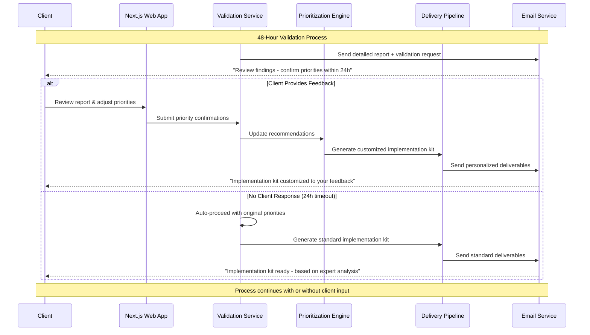

# Core Workflows

ScaleMap's core workflows orchestrate the complete journey from assessment submission to implementation kit delivery within 72 hours. These sequence diagrams illustrate the key system interactions and agent coordination patterns.

## Complete Assessment Pipeline (72-Hour Journey)

## Agent Orchestration Workflow (Multi-Agent Coordination)

## Document Processing & Agent Integration Workflow

## Payment & Assessment Activation Workflow

## Client Validation & Feedback Integration Workflow

## Real-Time Progress Communication Workflow

## Error Handling & Recovery Workflow

